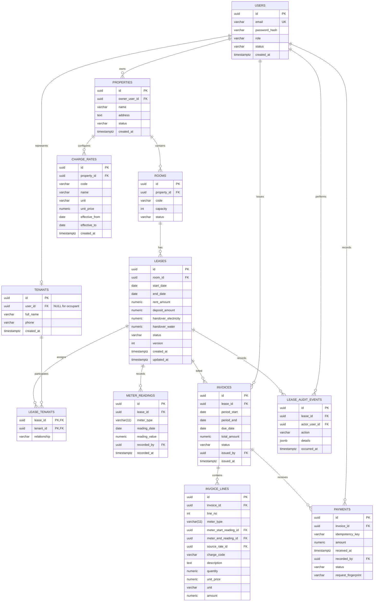

# Mô hình dữ liệu MVP

## Phạm vi và luồng chính

RM-001 thiết kế dữ liệu cho một chủ trọ quản lý một hoặc vài khu trọ. MVP có hai vai trò:

- `LANDLORD`: quản lý khu trọ của mình, phòng, hợp đồng, chỉ số, phiếu thu và thanh toán.
- `TENANT`: chỉ xem hợp đồng mà tài khoản của mình được gắn vào, phiếu thu và các thanh toán của hợp đồng đó.

Luồng chính là: chủ trọ tạo khu trọ và phòng -> gắn người thuê vào hợp đồng -> ghi chỉ số bàn giao và chỉ số kỳ -> lập phiếu nháp -> phát hành phiếu tháng -> người thuê xem phiếu -> chủ trọ ghi nhận một hoặc nhiều lần thanh toán.

Đây là thiết kế, chưa phải migration hay schema đã chạy. Tên enum có thể được biểu diễn bằng PostgreSQL enum hoặc `varchar` có `CHECK`; quyết định cụ thể thuộc RM-002.

## ERD

## Trách nhiệm và quan hệ

| Bảng | Trách nhiệm và quan hệ |
| --- | --- |
| `users` | Danh tính đăng nhập và vai trò. `LANDLORD` sở hữu `properties`; tài khoản `TENANT` có thể đại diện cho một hồ sơ `tenants`. Quyền luôn lấy từ phiên xác thực, không từ request. |
| `properties` | Khu trọ thuộc một chủ trọ. Là phạm vi sở hữu để kiểm tra quyền qua `properties.owner_user_id`. |
| `rooms` | Phòng thuộc một khu; `code` chỉ duy nhất trong khu. Không xóa vật lý khi đã có lịch sử. |
| `tenants` | Hồ sơ người thuê tối thiểu. `user_id` nullable để người ở cùng không cần tài khoản; chỉ tenant có tài khoản mới có thể làm đại diện truy cập MVP. |
| `leases` | Hợp đồng cho thuê một phòng, chứa khoảng ngày, giá thuê và tiền cọc đã thỏa thuận, cùng chỉ số bàn giao. Đây là gốc kiểm tra quyền, hóa đơn và chỉ số. |
| `lease_tenants` | Liên kết người thuê với hợp đồng. Partial UNIQUE chỉ bảo đảm tối đa một đại diện; khi chuyển lease sang `ACTIVE`, transaction còn phải kiểm tra đúng một đại diện có `tenants.user_id` khác NULL và user có role `TENANT`. `OCCUPANT` có thể không có tài khoản. |
| `meter_readings` | Chuỗi chỉ số điện/nước theo hợp đồng. Mỗi reading là một mốc; invoice line lưu reading đầu và cuối kỳ để tạo usage snapshot, không sửa lịch sử. MVP không nhận reading hồi tố sau mốc mới nhất. |
| `charge_rates` | Cấu hình giá theo `property_id + code` và thời gian hiệu lực. Giá của kỳ được chọn tại đầu kỳ, không phải ngày phát hành; thay đổi chỉ có hiệu lực từ đầu kỳ tiếp theo. |
| `invoices` | Một phiếu thu cho một hợp đồng và một kỳ tháng. Khi `ISSUED`, phần kỳ, tổng tiền và dòng chi tiết bị khóa. Trạng thái trả được suy ra từ các payment đã xác nhận. |
| `invoice_lines` | Chi tiết bất biến của phiếu: snapshot tên/mã phí, số lượng, đơn giá, đơn vị và thành tiền đã làm tròn. Dòng điện/nước còn giữ loại công tơ, reading đầu/cuối và giá nguồn để truy vết; các liên kết không được dùng để tính lại line đã phát hành. |
| `payments` | Mỗi lần chủ trọ xác nhận tiền là một dòng riêng. Key kèm fingerprint chống gửi lại hoặc đổi dữ liệu của cùng request; không xóa hoặc gộp các lần trả. |
| `lease_audit_events` | Nhật ký append-only cho tạo/sửa/chuyển trạng thái hợp đồng, lưu actor, thời điểm và chi tiết thay đổi. Không dùng để thay thế dữ liệu hiện hành. |

## Từ điển dữ liệu và ràng buộc

Quy ước chung: khóa dùng `uuid`; tiền VND là `numeric(19,2)` theo nguyên đồng, tức scale 2 chỉ là định dạng lưu và giá trị hợp lệ phải có phần thập phân bằng `00`; quantity/chỉ số là `numeric(19,3)`. Timestamp là `timestamptz` lưu thời điểm thực; ngày thuê, ngày đọc và kỳ thu là `date` theo lịch kinh doanh `Asia/Ho_Chi_Minh`. `NULL` chỉ được phép khi cột ghi rõ.

### Identity và tài sản

| Bảng.cột | Kiểu | Bắt buộc | Ràng buộc / ý nghĩa |
| --- | --- | --- | --- |
| `users.id` | `uuid` | Có | PK. |
| `users.email` | `varchar(320)` | Có | UNIQUE, chuẩn hóa lowercase; dùng làm định danh đăng nhập. |
| `users.password_hash` | `varchar(255)` | Có | Chỉ lưu hash, không lưu mật khẩu. |
| `users.role` | `varchar(20)` | Có | CHECK `LANDLORD` hoặc `TENANT`. |
| `users.status` | `varchar(20)` | Có | CHECK `ACTIVE` hoặc `DISABLED`. |
| `users.created_at` | `timestamptz` | Có | Thời điểm tạo tài khoản; không đổi. |
| `properties.owner_user_id` | `uuid` | Có | FK `users`; phải trỏ tới user `LANDLORD` ở tầng nghiệp vụ. |
| `properties.name` | `varchar(160)` | Có | Tên khu trọ không rỗng. |
| `properties.address` | `text` | Có | Địa chỉ tối thiểu của khu. |
| `properties.status` | `varchar(20)` | Có | CHECK `ACTIVE` hoặc `ARCHIVED`; archive không xóa lịch sử. |
| `properties.created_at` | `timestamptz` | Có | Thời điểm tạo khu. |
| `rooms.property_id` | `uuid` | Có | FK `properties`, `ON DELETE RESTRICT`. |
| `rooms.code` | `varchar(50)` | Có | UNIQUE theo `(property_id, code)`. |
| `rooms.capacity` | `integer` | Có | CHECK `capacity > 0`. |
| `rooms.status` | `varchar(20)` | Có | CHECK `ACTIVE` hoặc `ARCHIVED`; không archive nếu còn lease cần quản lý. |
| `tenants.id` | `uuid` | Có | PK. |
| `tenants.user_id` | `uuid` | Không | Nullable FK `users`, UNIQUE khi khác NULL; nếu có giá trị phải trỏ user role `TENANT`. |
| `tenants.full_name` | `varchar(160)` | Có | Tên người thuê. |
| `tenants.phone` | `varchar(30)` | Không | Thông tin liên hệ tối thiểu nếu có. |
| `tenants.created_at` | `timestamptz` | Có | Thời điểm tạo hồ sơ. |

### Hợp đồng và chỉ số

| Bảng.cột | Kiểu | Bắt buộc | Ràng buộc / ý nghĩa |
| --- | --- | --- | --- |
| `leases.room_id` | `uuid` | Có | FK `rooms`, `ON DELETE RESTRICT`. |
| `leases.start_date` | `date` | Có | Ngày bắt đầu, bao gồm. |
| `leases.end_date` | `date` | Không | Ngày kết thúc, loại trừ; `NULL` nghĩa là chưa có ngày kết thúc. Khi có giá trị phải `end_date > start_date`. |
| `leases.rent_amount` | `numeric(19,2)` | Có | VND, không âm; là giá thuê đã thỏa thuận của hợp đồng. |
| `leases.deposit_amount` | `numeric(19,2)` | Có | VND, không âm; chỉ ghi nhận, chưa tự khấu trừ. |
| `leases.handover_electricity`, `handover_water` | `numeric(19,3)` | Có | Không âm; chỉ số bàn giao. |
| `leases.status` | `varchar(20)` | Có | CHECK `DRAFT`, `ACTIVE`, `ENDED`, `CANCELLED`. Chỉ `ACTIVE` và `ENDED` tham gia chống overlap; `DRAFT` chưa giữ phòng, `CANCELLED` không giữ phòng. `ENDED` giữ khoảng lịch sử. |
| `leases.version` | `integer` | Có | CHECK `version >= 0`, bắt đầu từ 0; optimistic locking cho cập nhật hợp đồng. |
| `leases.created_at`, `.updated_at` | `timestamptz` | Có | Thời điểm tạo và cập nhật; không thay thế audit event. |
| `lease_tenants.lease_id`, `.tenant_id` | `uuid` | Có | PK kép, FK tương ứng và `ON DELETE RESTRICT`; không xóa lịch sử khi đã có hóa đơn. |
| `lease_tenants.relationship` | `varchar(20)` | Có | CHECK `REPRESENTATIVE` hoặc `OCCUPANT`. Partial UNIQUE `(lease_id) WHERE relationship = 'REPRESENTATIVE'` chỉ bảo đảm tối đa một; trigger/use case activation phải bảo đảm đúng một representative có tài khoản `TENANT`. |
| `meter_readings.lease_id` | `uuid` | Có | FK `leases`, `ON DELETE RESTRICT`. |
| `meter_readings.meter_type` | `varchar(11)` | Có | CHECK `ELECTRICITY` hoặc `WATER`. |
| `meter_readings.reading_date` | `date` | Có | Không sớm hơn ngày bắt đầu hợp đồng; UNIQUE `(lease_id, meter_type, reading_date)`. |
| `meter_readings.reading_value` | `numeric(19,3)` | Có | CHECK `reading_value >= 0`. Trigger/database transaction kiểm tra mới `>=` giá trị trước; `reading_date` mới phải sau mốc trước. MVP không nhập hồi tố sau mốc mới nhất. |
| `meter_readings.recorded_by` | `uuid` | Có | FK `users`; actor được lưu để audit. |
| `meter_readings.recorded_at` | `timestamptz` | Có | Thời điểm ghi nhận reading. |

Hợp đồng không chồng nhau được bảo vệ ở PostgreSQL bằng `EXCLUDE USING gist`: chỉ lease `ACTIVE` và `ENDED` tham gia; cùng `room_id` không được có hai `daterange(start_date, COALESCE(end_date, 'infinity'), '[)')` giao nhau. `DRAFT` chưa giữ phòng vì chưa được kích hoạt; `CANCELLED` không giữ phòng. `ENDED` vẫn giữ khoảng lịch sử để không tạo hợp đồng mâu thuẫn với dữ liệu đã phát sinh. Lease chuyển sang `ENDED` phải có `end_date`.

Partial UNIQUE trên `lease_tenants` chỉ có nghĩa là **tối đa một** dòng `REPRESENTATIVE` cho mỗi lease. Khi kích hoạt lease, một transaction phải khóa lease, kiểm tra có **đúng một** representative, `tenants.user_id IS NOT NULL`, user đó tồn tại và có role `TENANT`; nếu không thì từ chối activation. TENANT MVP chỉ được tra cứu qua representative có tài khoản, không qua occupant không có tài khoản.

Phiếu tháng có thể tồn tại ở `DRAFT` để chuẩn bị, nhưng chỉ được chuyển sang `ISSUED` khi toàn bộ kỳ `[period_start, period_end)` nằm trong `[lease.start_date, lease.end_date)`; với lease chưa có end date chỉ cần không sớm hơn start. Kỳ tháng bắt đầu hoặc kết thúc giữa thời gian thuê bị từ chối, không prorate và không phát hành. Kiểm tra này cần transaction/trigger khi issue vì liên quan cả invoice và lease.

Với line điện/nước, `meter_start_reading_id` và `meter_end_reading_id` phải cùng lease, cùng `meter_type` với line, có `start.reading_date < end.reading_date`, và line `quantity` phải bằng `end.reading_value - start.reading_value`. Hai reading tạo đúng khoảng sử dụng của invoice; không cho invoice khác của cùng lease và loại meter dùng lại hoặc chồng khoảng reading đã chốt. MVP không nhận reading hồi tố: reading mới phải sau hoặc cùng mốc cuối (cùng ngày bị unique), và phải không nhỏ hơn mốc cuối; sửa sai cần adjustment ngoài MVP. Nếu sau này cho hồi tố, phải kiểm tra cả reading liền trước và liền sau trong cùng transaction rồi tính lại các invoice bị ảnh hưởng theo một nghiệp vụ riêng.

### Giá, phiếu và thanh toán

| Bảng.cột | Kiểu | Bắt buộc | Ràng buộc / ý nghĩa |
| --- | --- | --- | --- |
| `charge_rates.id` | `uuid` | Có | PK. |
| `charge_rates.property_id` | `uuid` | Có | FK `properties`, là phạm vi của mã giá. |
| `charge_rates.code` | `varchar(50)` | Có | Không rỗng; phạm vi duy nhất/range là `(property_id, code)`. |
| `charge_rates.name` | `varchar(160)` | Có | Tên phí; snapshot vào line. |
| `charge_rates.unit` | `varchar(30)` | Có | Đơn vị như `VND/MONTH`, `VND/KWH`. |
| `charge_rates.unit_price` | `numeric(19,2)` | Có | CHECK `unit_price >= 0`; giá có hiệu lực từ `effective_from` đến trước `effective_to`. |
| `charge_rates.effective_from`, `.effective_to` | `date` | Có / Không | `effective_to > effective_from` nếu có; không cho hai giá cùng `(property_id, code)` có khoảng hiệu lực giao nhau. |
| `charge_rates.created_at` | `timestamptz` | Có | Thời điểm tạo giá; giá đã dùng không sửa, tạo version mới. |
| `invoices.lease_id` | `uuid` | Có | FK `leases`, `ON DELETE RESTRICT`. |
| `invoices.period_start`, `.period_end` | `date` | Có | Kỳ tháng đầy đủ: `period_start` là ngày đầu tháng và `period_end = period_start + 1 month`; `period_end` loại trừ. UNIQUE `(lease_id, period_start)`. |
| `invoices.due_date` | `date` | Có | Không sớm hơn `period_start`; quy tắc ngày đến hạn là giả định MVP trong decision record. |
| `invoices.total_amount` | `numeric(19,2)` | Có | Không âm; bằng tổng line sau làm tròn. |
| `invoices.status` | `varchar(20)` | Có | CHECK `DRAFT` hoặc `ISSUED`; khóa nội dung là quy tắc nghiệp vụ riêng, không phải FK. |
| `invoices.issued_by`, `.issued_at` | `uuid`, `timestamptz` | Không | FK `issued_by -> users`; bắt buộc cùng nhau khi `ISSUED`; actor và thời điểm phát hành. |
| `invoice_lines.id` | `uuid` | Có | PK. |
| `invoice_lines.invoice_id` | `uuid` | Có | FK `invoices`, `ON DELETE RESTRICT`; không phải cơ chế khóa nội dung ISSUED. |
| `invoice_lines.line_no` | `integer` | Có | UNIQUE `(invoice_id, line_no)`, bắt đầu từ 1. |
| `invoice_lines.meter_type` | `varchar(11)` | Không | NULL với dòng không phải meter; nếu có phải `ELECTRICITY` hoặc `WATER`. |
| `invoice_lines.meter_start_reading_id`, `.meter_end_reading_id` | `uuid` | Không | FK `meter_readings`; cùng lease với invoice, cùng `meter_type`, ngày đầu < ngày cuối, usage = end - start; bắt buộc đồng thời cho dòng meter. |
| `invoice_lines.source_rate_id` | `uuid` | Không | FK `charge_rates`; giá được chọn theo `period_start`, chỉ để truy vết, snapshot vẫn nằm ở line. |
| `invoice_lines.charge_code` | `varchar(50)` | Có | Snapshot mã phí tại thời điểm phát hành. |
| `invoice_lines.description` | `text` | Có | Snapshot mô tả; không đổi sau ISSUED. |
| `invoice_lines.quantity` | `numeric(19,3)` | Có | CHECK `quantity >= 0`. |
| `invoice_lines.unit_price` | `numeric(19,2)` | Có | Snapshot; CHECK `unit_price >= 0`. |
| `invoice_lines.unit` | `varchar(30)` | Có | Snapshot đơn vị. |
| `invoice_lines.amount` | `numeric(19,2)` | Có | Snapshot `ROUND(quantity * unit_price, 0)` theo HALF_UP ở lớp tính tiền; CHECK không âm. |
| `payments.id` | `uuid` | Có | PK. |
| `payments.invoice_id` | `uuid` | Có | FK `invoices`, chỉ nhận invoice `ISSUED`. |
| `payments.idempotency_key` | `varchar(100)` | Có | UNIQUE `(invoice_id, idempotency_key)`; gửi lại cùng key cho cùng invoice trả lại kết quả cũ. |
| `payments.request_fingerprint` | `varchar(128)` | Có | Hash ổn định của payload được phép; cùng key khác fingerprint là xung đột, không ghi payment mới. |
| `payments.amount` | `numeric(19,2)` | Có | CHECK `amount > 0`. |
| `payments.received_at`, `.recorded_by` | `timestamptz`, `uuid` | Có | Thời điểm tiền thực nhận và chủ trọ thực hiện. |
| `payments.status` | `varchar(20)` | Có | MVP chỉ ghi `CONFIRMED`; không coi ảnh chuyển khoản/client là bằng chứng. |
| `lease_audit_events.id` | `uuid` | Có | PK. |
| `lease_audit_events.lease_id` | `uuid` | Có | FK `leases`, `ON DELETE RESTRICT`. |
| `lease_audit_events.actor_user_id` | `uuid` | Có | FK `users`; user thực hiện thay đổi. |
| `lease_audit_events.action` | `varchar(40)` | Có | CHECK theo tập action được ứng dụng công nhận, ví dụ `CREATED`, `ACTIVATED`, `UPDATED`, `ENDED`, `CANCELLED`. |
| `lease_audit_events.details` | `jsonb` | Có | Snapshot thay đổi cần audit; không dùng làm dữ liệu hiện hành. |
| `lease_audit_events.occurred_at` | `timestamptz` | Có | Thời điểm hành động. |

Giá được chọn theo kỳ sử dụng: tại thời điểm lập invoice, chọn rate có `effective_from <= period_start` và (`effective_to IS NULL` hoặc `period_start < effective_to`) trong đúng `property_id + code`. Rate chỉ được đổi từ ngày đầu kỳ tiếp theo. PostgreSQL dùng exclusion constraint trên `(property_id, code, daterange(effective_from, COALESCE(effective_to, 'infinity'), '[)'))` để cấm khoảng hiệu lực chồng nhau trong đúng phạm vi đó.

Khi ghi payment, một transaction thực hiện đúng thứ tự: (1) khóa dòng `invoices` bằng `SELECT ... FOR UPDATE`; (2) tìm `invoice_id + idempotency_key`; (3) nếu đã có, so fingerprint, cùng dữ liệu thì trả lại kết quả cũ ngay cả khi invoice đã `PAID`, khác dữ liệu thì trả lỗi conflict; (4) nếu chưa có, kiểm tra invoice `ISSUED`, amount > 0 và dư nợ; (5) insert payment cùng fingerprint; (6) commit. Vì retry hợp lệ dùng lại key và payload cũ, nó thành công/idempotent sau khi phiếu đã trả đủ.

Constraint trigger ở database có thể kiểm tra tổng payment không vượt `invoices.total_amount` như một hàng rào phòng thủ, nhưng không tự được coi là cơ chế bảo đảm an toàn đồng thời. An toàn đồng thời đến từ việc mọi đường ghi payment khóa cùng invoice theo cùng thứ tự trong transaction; unique idempotency xử lý request lặp.

## Quyền truy cập và bảo toàn lịch sử

- LANDLORD được phép qua chuỗi `invoice -> lease -> room -> property -> owner_user_id` và tương tự với payment, meter reading.
- TENANT chỉ được phép qua `invoice -> lease -> lease_tenants -> tenants -> user_id` của chính session; mọi API danh sách, chi tiết và lịch sử đều áp dụng điều kiện này.
- Không nhận `owner_user_id`, `role`, `payment.status` hoặc tổng tiền có thẩm quyền từ client.
- Invoice `ISSUED`, invoice line, payment, meter reading và audit event là append-only về nghiệp vụ. Sửa sai phiếu cần nghiệp vụ điều chỉnh riêng, chưa có trong MVP.
- Xóa vật lý bị chặn bằng FK/restrict hoặc không cung cấp thao tác xóa; dùng `status`/archive để giữ lịch sử.

## Đối chiếu RM-001

Thiết kế đã bao phủ: quyền theo hợp đồng; một phiếu mỗi lease/kỳ; snapshot đơn giá và dòng phí; nhiều payment; khoảng thuê không chồng; chỉ số không giảm; request thanh toán lặp và đồng thời; giá trị tiền `numeric` và làm tròn HALF_UP; actor/thời điểm phát hành, thanh toán và thay đổi hợp đồng.

Điểm còn thiếu có chủ ý: cách tính tháng lẻ, tiền cọc/hoàn cọc, điều chỉnh invoice đã phát hành, đối soát ngân hàng, nhiều tài khoản cùng hợp đồng và ngày đến hạn theo thỏa thuận thực tế chưa có trong tài liệu hoặc nằm ngoài MVP. Các điểm cần khảo sát người dùng thật được đánh dấu trong decision record. RM-002 cần chuyển các constraint/triggers/index nêu trên thành migration PostgreSQL và kiểm thử tích hợp, không dùng `ddl-auto=update`.

## Ví dụ P101

1. Ngày `2026-02-01`, tạo `rooms(code = 'P101')` và lease từ `2026-02-01` đến `2026-05-01` (ngày cuối loại trừ), tiền thuê `3,000,000.00`, tiền cọc `3,000,000.00`. Gắn tenant A làm `REPRESENTATIVE` với tài khoản role `TENANT`; thêm occupant B với `user_id = NULL`. Một lease khác giao với khoảng này sẽ bị exclusion constraint từ chối.
2. Với kỳ `[2026-02-01, 2026-03-01)`, ghi reading đầu ngày `2026-02-01`: điện `100.000`, nước `20.000`; reading cuối ngày `2026-03-01`: điện `112.500`, nước `23.250`. Rate có hiệu lực từ `2026-02-01` là điện `3,000.00 VND/KWH`, nước `20,000.00 VND/M3`. Khi issue, line điện liên kết hai reading và snapshot quantity `12.500`, đơn giá `3,000.00`, thành tiền `37,500.00`; line nước quantity `3.250`, đơn giá `20,000.00`, thành tiền `65,000.00`; line tiền thuê là `3,000,000.00`. Tổng invoice chính xác `3,102,500.00`. Đổi rate từ `2026-03-01` không đổi invoice tháng 02; phát hành ngày muộn vẫn dùng rate được chọn tại `period_start`.
3. Chủ trọ ghi payment lần một `1,500,000.00`, dư nợ còn `1,602,500.00`; ghi lần hai `1,602,500.00`, trạng thái suy ra `PAID`. Retry lần một với cùng idempotency key và fingerprint trả lại payment cũ, không tạo dòng thứ ba; cùng key nhưng đổi số tiền là conflict. Hai payment mới đồng thời phải lần lượt khóa invoice, vì vậy không thể cùng dùng một dư nợ cũ.